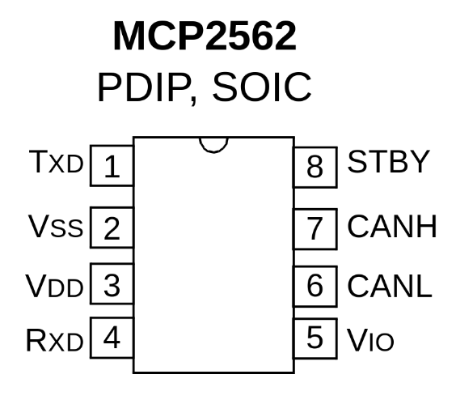

# pico-multi-bridge

Raspberry Pico (RP2040) multifunctional USB bridge, consisting of  
gs_usb compatible firmware for interfacing CAN bus via can2040 and a cheap CAN transceiver,  
and multiple USB CDC serial "adapters".


## Hardware

CAN Transceivers often run off of 5v. Make sure to get one that can be controlled over 3.3V!
I used an MCP2562, which does not support 3.3v on the output side, and has an extra pin vor logic voltage.




|  Pin  | What it do                 |
|-------|----------------------------|
|  TXD  | Set can2040 tx pin to this |
|  Vss  | GND                        |
|  Vdd  | 5v                         |
|  RXD  | Set can2040 rx pin to this |
|  STBY | HIGH = transceiver off, pulled up |
|  CANH | CAN out                    |
|  CANL | CAN out                    |
|  Vio | 3.3v / µC comms voltage     |


## Build
1. install Raspberry Pico SDK
2. make sure environment variable `PICO_SDK_PATH` points to installed SDK

```sh
$ mkdir build
$ cd build
$ cmake ..
$ make -j$(nproc)
```

## Flash
Enter flashing bootloader via:
1) Keep `BOOTSEL` button pressed
2) Reset the board with button or re-plugging power
3) Release `BOOTSEL` button

Load the firmware via `picotool load gs_usb_PICO_CAN2040.uf2` command or by copying that file into connected USB mass storage provided by RP2040 BOOT ROM.
Reset the board afterwards.


## Use
You should see `can0` interface once the device is connected to USB.
```sh
$ ip a
...
96: can0: <NOARP,ECHO> mtu 16 qdisc noop state DOWN group default qlen 10
    link/can
```

Now you can configure bitrate and bring interface up:
```sh
$ sudo ip link set can0 type can bitrate 500000
$ sudo ip link set can0 up
```

You can receive and send messages with `can-utils` package:
```sh
$ candump can0
$ cansend can0 123#DEADBEEF
```

Use following udev rule for more predictable interface name and reload with `udevadm control --reload-rules`:
```
# /etc/udev/rules.d/79-can.rules
ACTION=="add", ENV{ID_SERIAL}=="D_rp2040-can_123456", NAME="mycan"
```

Interface may be managed with `systemd-networkd`:
```
# /etc/systemd/network/can.network
[Match]
Name=mycan
# or apply same config to all CAN interfaces
#Type=can

[CAN]
BitRate=500000
```

## Tests
Both tests requires two CAN interfaces connected to single host.

### `hw_test.py`
```sh
$ RP2040_IFACE=mycan TEST_IFACE=othercan pytest
```

### Stress testing
Fully utilizes CAN bus by spamming randomly generated messages in a loop. All messages are also verified on receiver side.
```sh
$ make tests/stress
$ ./tests/stress mycan othercan
$ ./tests/stress othercan mycan
```
